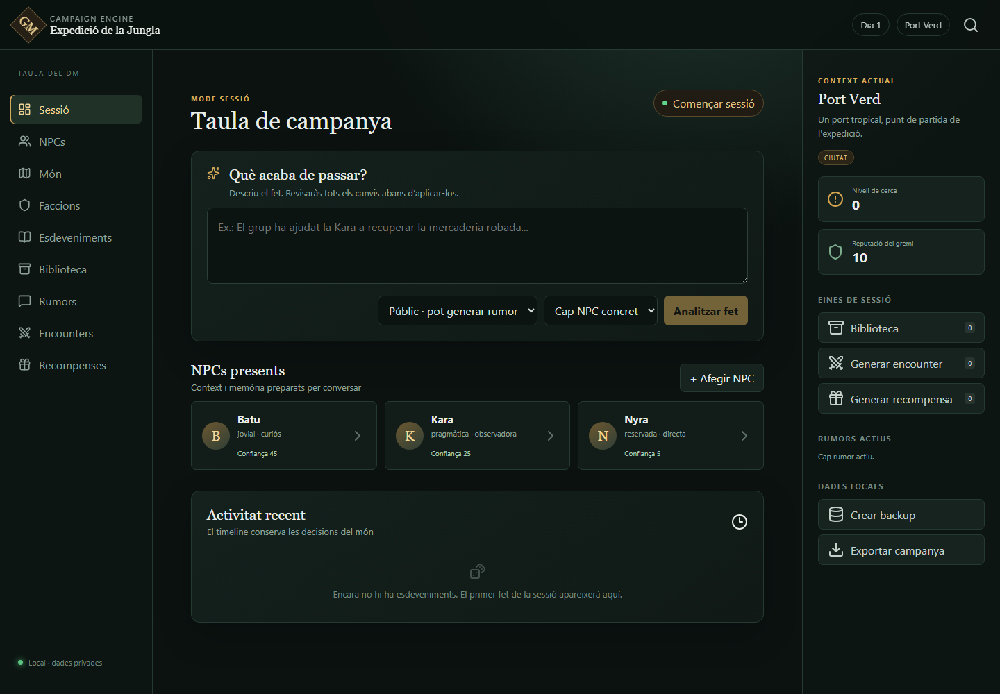

# GM AI — Campaign Engine

Assistent local per a directors de joc de D&D 5e. Manté l'estat de la campanya, les relacions i les memòries dels NPC en una base SQLite, i utilitza un LLM local només per interpretar el context i generar diàleg.



Aquest repositori implementa la **vertical slice 0.1** definida a [`projecte_gm_ai.md`](projecte_gm_ai.md):

- dashboard de sessió usable al navegador;
- una campanya de demostració, una localització, una facció i tres NPC;
- persistència SQLite i dades inicials automàtiques;
- registre de fets en llenguatge natural;
- proposta de conseqüències que el DM ha d'aplicar o ignorar explícitament;
- memòria i relacions persistents dels NPC;
- conversa contextual amb mode simulat, Ollama o LM Studio;
- alta i edició d'NPC, memòries manuals i cerca global;
- inici i final de sessions amb resum;
- edició de propostes i desfer transaccional dels canvis aplicats;
- exportació/importació JSON i backups SQLite consistents;
- biblioteca local per PDF, Markdown, text, imatges i mapes;
- extracció de text per pàgina, fragments cercables i referències de font;
- coneixement i creences diferenciades per NPC;
- generació i propagació automàtica de rumors a partir d'esdeveniments públics;
- Encounter Engine contextual per terreny, nivell, mida del grup, tipus i dificultat;
- Reward Engine contextual per ubicació, nivell, dificultat i fortuna opcional;
- taules d'encounters i recompenses ampliables amb entrades homebrew;
- API REST documentada automàticament amb OpenAPI.

> El projecte no distribueix text, mapes, personatges ni altres continguts de cap aventura comercial. Pots importar-hi el contingut que tinguis dret a utilitzar.

## Posada en marxa

Requisits: Python 3.11 o superior i Node.js 20 o superior.

### 1. Backend

```powershell
cd backend
python -m venv .venv
.venv\Scripts\Activate.ps1
python -m pip install -r requirements.txt
python -m uvicorn app.main:app --reload
```

La documentació de l'API quedarà disponible a <http://localhost:8000/docs>.

### 2. Frontend

En una altra terminal:

```powershell
cd frontend
npm install
npm run dev
```

Obre <http://localhost:5173>. En la primera arrencada el backend crea `data/campaign.db` i hi carrega la campanya de demostració.

### Arrencada assistida a Windows

Després d'haver instal·lat les dependències almenys una vegada, també pots fer doble clic a `start-gm-ai.cmd`. El launcher comprova la compilació, inicia FastAPI en segon pla i obre <http://localhost:8000>. Per aturar-lo:

```powershell
powershell -ExecutionPolicy Bypass -File scripts\stop-local.ps1
```

### Docker

```powershell
docker compose up --build
```

Amb Docker, frontend i API s'ofereixen junts a <http://localhost:8000>, i `data/` i `backups/` continuen persistint al directori local.

## Connectar un LLM local

Per defecte `GM_AI_LLM_PROVIDER=mock`: tot funciona sense model i les respostes serveixen per validar el flux.

Copia `.env.example` a `.env` i tria una opció:

```dotenv
# Ollama
GM_AI_LLM_PROVIDER=ollama
GM_AI_LLM_BASE_URL=http://localhost:11434
GM_AI_LLM_MODEL=llama3.1:8b
```

```dotenv
# LM Studio, amb el servidor local OpenAI-compatible actiu
GM_AI_LLM_PROVIDER=lmstudio
GM_AI_LLM_BASE_URL=http://localhost:1234
GM_AI_LLM_MODEL=nom-del-model-carregat
```

Cap clau ni conversa s'envia al núvol. Un error de connexió al model retorna HTTP 503 sense modificar l'estat del món.

## Biblioteca local

Des de `Biblioteca` pots carregar PDF, TXT, Markdown, PNG, JPG i WebP. Els documents es desen sota `library/`, una carpeta exclosa de Git. Els PDF amb text s'indexen per pàgina; si un PDF és només una imatge, queda marcat com `Necessita OCR` per no donar una falsa sensació que és consultable.

Els fitxers oficials comprats no s'inclouen als exports de campanya. L'export sí que conserva les dades estructurades creades pel DM: coneixement, rumors, encounters, recompenses i taules homebrew.

## Encounter i Reward Engine

Els dos generadors permeten escollir terreny i dificultat de l'1 al 5. Els encounters també consideren nivell, mida del grup, tipus i estat del món. Les recompenses poden relacionar-se amb l'últim encounter i funcionar en mode neutral o amb tirada de fortuna d20.

Les opcions inicials són petites deliberadament. Les taules i entrades custom es poden administrar amb els endpoints `/generation-tables` i `/generation-entries`; el format està documentat a [`docs/generation-engines.md`](docs/generation-engines.md).

## Validació

```powershell
cd backend
python -m unittest discover -s tests -v
python -m compileall app tests
```

```powershell
cd frontend
npm run build
```

## Arquitectura

```text
React / TypeScript
        │ REST/JSON
        ▼
FastAPI application services
        │
        ├── Domain models and rules
        ├── SQLite repository
        └── LLMProvider
              ├── Mock
              ├── Ollama
              └── LM Studio
```

La base de dades és la font de veritat. El LLM rep només el context rellevant i no escriu directament a SQLite. Consulta [`docs/architecture.md`](docs/architecture.md) i [`docs/api.md`](docs/api.md).

## Abast actual i roadmap

La versió 0.3 valida el flux essencial i ja incorpora biblioteca, coneixement diferenciat, rumors, encounters, recompenses i taules custom. Queden per a fases posteriors l'OCR, embeddings semàntics, editor visual avançat de taules, mapes interactius amb marcadors i regles D&D 5e més exhaustives.

## Publicació a GitHub

El directori ja inclou `.gitignore`, llicència MIT i integració contínua. Per convertir-lo en un repositori independent:

```powershell
git init
git add .
git commit -m "feat: vertical slice inicial de GM AI"
git branch -M main
git remote add origin https://github.com/USUARI/gm-ai.git
git push -u origin main
```

Abans del `git add`, comprova que `.env` i `data/campaign.db` no apareixen a `git status`.

## Llicència

Codi publicat sota llicència [MIT](LICENSE). D&D i les aventures publicades són propietat dels seus titulars respectius; aquesta eina no hi està afiliada.
