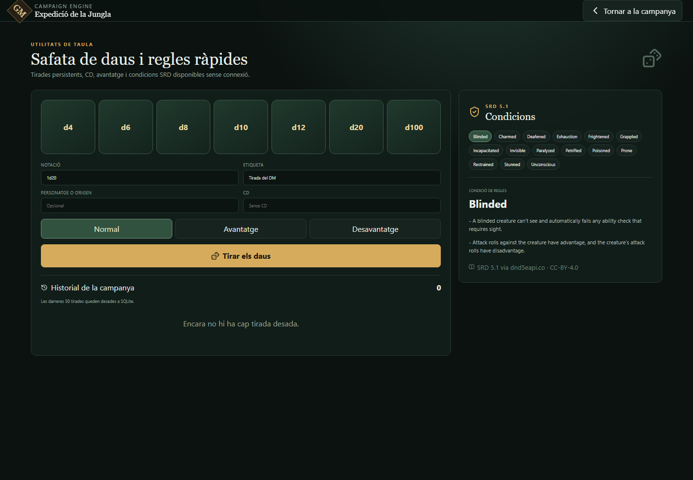

# Eines de taula

El mòdul `Eines de taula` és local i no necessita cap LLM ni connexió externa. Reuneix una safata de daus persistent i una consulta ràpida de condicions de l'SRD 5.1.

Es pot obrir des del menú del DM o directament amb `http://localhost:8000/?view=tools`.

## Safata de daus

- Accepta notacions entre `1d2` i `20d100`, amb modificador opcional: `1d20+5`, `2d6-1` o `8d8`.
- Els modes d'avantatge i desavantatge només accepten `1d20`: es tiren dos d20 i es conserva respectivament el resultat més alt o més baix.
- Una CD entre 1 i 40 és opcional. Si s'indica, el resultat queda marcat com a èxit o fallada.
- En una tirada d'un d20, el sistema identifica un 20 o un 1 natural, però no altera automàticament les regles de la prova: el context final continua sent decisió del DM.
- Les darreres 50 tirades es mostren a la interfície. L'historial complet queda separat per campanya a la taula SQLite `dice_rolls`, s'inclou a l'export JSON i es pot buidar amb confirmació.

La implementació segueix la regla de l'SRD 5.1 segons la qual l'avantatge tira un segon d20 i conserva el més alt, mentre que el desavantatge conserva el més baix. Si una situació té alhora avantatge i desavantatge, el DM ha d'escollir `Normal`, ja que es cancel·len.

## Condicions SRD

El catàleg incorpora les 15 condicions de les regles de 2014: `blinded`, `charmed`, `deafened`, `exhaustion`, `frightened`, `grappled`, `incapacitated`, `invisible`, `paralyzed`, `petrified`, `poisoned`, `prone`, `restrained`, `stunned` i `unconscious`.

Les entrades es regeneren amb `scripts/import_srd_catalog.py` des de l'endpoint versionat `/api/2014/conditions` de D&D 5e API i queden empaquetades al JSON local. La partida no consulta aquesta API.

## Fonts i llicència

- [Basic Rules 2014: Advantage and Disadvantage](https://www.dndbeyond.com/sources/dnd/basic-rules-2014/using-ability-scores)
- [Basic Rules 2014: Appendix A, Conditions](https://www.dndbeyond.com/sources/dnd/basic-rules-2014/appendix-a-conditions)
- [D&D 5e SRD API: Condition](https://5e-bits.github.io/docs/api/get-a-condition-by-index)

El contingut SRD empaquetat manté l'atribució CC-BY-4.0 descrita a [`NOTICE-SRD.md`](../NOTICE-SRD.md).
